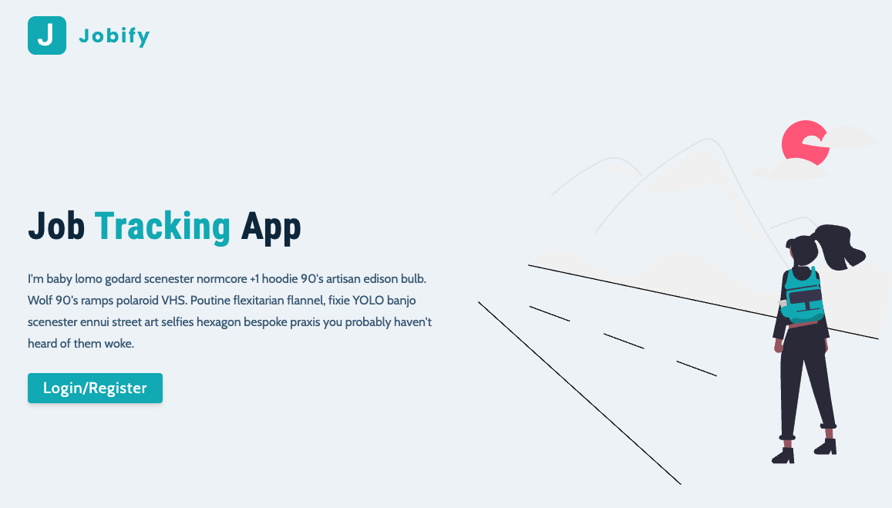
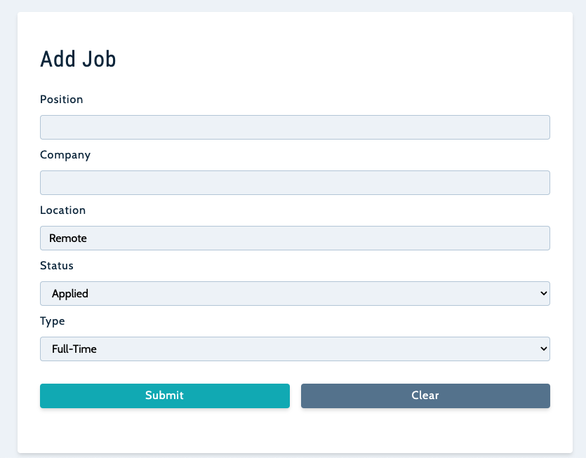
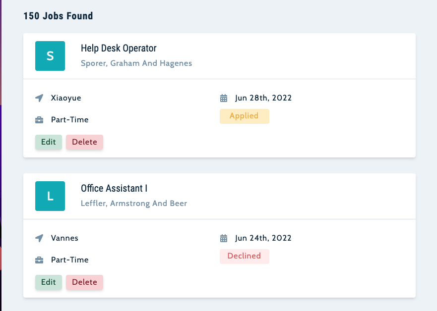
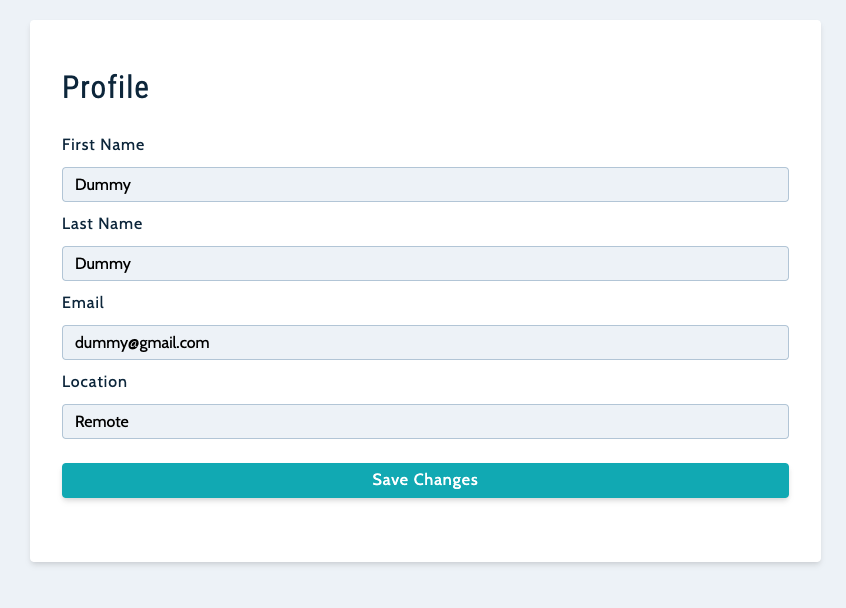

<!--
Hey, thanks for using the awesome-readme-template template.  
If you have any enhancements, then fork this project and create a pull request 
or just open an issue with the label "enhancement".

Don't forget to give this project a star for additional support ;)
Maybe you can mention me or this repo in the acknowledgements too
-->
<div align="center">

  
  <h1>Documentation</h1>
  
  <p>
    A MERN stack application to track the status of all your job applications
  </p>
  
  
<!-- Badges -->
<p>
  <a href="https://github.com/mitchellramsey/sb_jobify/graphs/contributors">
    
  </a>
  <a href="https://github.com/mitchellramsey/sb_jobify/network/members">
    
  </a>
  <a href="https://github.com/mitchellramsey/sb_jobify/stargazers">
    
  </a>
  <a href="https://github.com/mitchellramsey/sb_jobify/issues/">
    
  </a>
  <a href="https://github.com/mitchellramsey/sb_jobify/blob/master/LICENSE">
    
  </a>
</p>
   
<h4>
    <a href="https://ramsey-jobify.herokuapp.com">View Demo</a>
  <span> · </span>
    <a href="https://github.com/mitchellramsey/sb_jobify">Documentation</a>
  <span> · </span>
    <a href="https://github.com/mitchellramsey/sb_jobify/issues/">Report Bug</a>
  <span> · </span>
    <a href="https://github.com/mitchellramsey/sb_jobify/issues/">Request Feature</a>
  </h4>
</div>

<br />

<!-- Table of Contents -->
# :notebook_with_decorative_cover: Table of Contents

- [About the Project](#star2-about-the-project)
  * [Screenshots](#camera-screenshots)
  * [Tech Stack](#space_invader-tech-stack)
  * [Features](#dart-features)
  * [Color Reference](#art-color-reference)
  * [Environment Variables](#key-environment-variables)
- [Getting Started](#toolbox-getting-started)
  * [Prerequisites](#bangbang-prerequisites)
  * [Installation](#gear-installation)
  * [Running Tests](#test_tube-running-tests)
  * [Run Locally](#running-run-locally)
  * [Deployment](#triangular_flag_on_post-deployment)
- [Usage](#eyes-usage)
- [Roadmap](#compass-roadmap)
- [Contributing](#wave-contributing)
  * [Code of Conduct](#scroll-code-of-conduct)
- [FAQ](#grey_question-faq)
- [License](#warning-license)
- [Contact](#handshake-contact)
- [Acknowledgements](#gem-acknowledgements)

  

<!-- About the Project -->
## :star2: About the Project
A MERN stack application that helps users keep track of the status of jobs that they are pursuing. The app allows users to track whether they have applied, interviewing, been declined, or accepted a job. Users are able to update their profile, create new jobs, edit/delete created jobs, and see their stats on jobs for which they have applied. 

<!-- Screenshots -->
### :camera: Screenshots

<div align="center">
  <h4>Home Page</h4>
  
  <h4>Add Job</h4>
  
  <h4>All Jobs</h4>
  
  <h4>Profile</h4>
  
</div>


<!-- TechStack -->
### :space_invader: Tech Stack

<details>
  <summary>Client</summary>
  <ul>
    <li><a href="https://reactjs.org/">React.js</a></li>
  </ul>
</details>

<details>
  <summary>Server</summary>
  <ul>
    <li><a href="https://expressjs.com/">Express.js</a></li>
  </ul>
</details>

<details>
<summary>Database</summary>
  <ul>
    <li><a href="https://www.mongodb.com/">MongoDB</a></li>
  </ul>
</details>

<details>
<summary>DevOps</summary>
  <ul>
    <li><a href="https://www.heroku.com/">Heroku</a></li>
  </ul>
</details>

<!-- Features -->
### :dart: Features

- Track status of applied jobs
- Search functionality for job criteria
- Stats for job statuses and number of jobs applied


<!-- Env Variables -->
### :key: Environment Variables

To run this project, you will need to add the following environment variables to your .env file

`MONGO_URL` - [How to Obtain MongoDB URL](https://www.mongodb.com/docs/compass/current/connect/)

`JWT_SECRET` - [Key Generator](https://www.allkeysgenerator.com/)

`JWT_LIFETIME` - value to set for expiration of JWT

<!-- Getting Started -->
## 	Getting Started

<!-- Prerequisites -->
### Cloning

Clone the project

```bash
  git clone https://github.com/mitchellramsey/sb_jobify.git
```

<!-- Installation -->
### Installation

Install my-project with npm

```bash
  cd jobify
  npm install && npm run install-client
```

<!-- Run Locally -->
### Run Locally

Start the server

```bash
  npm start
```

<!-- Build and Run Production -->
### Build Production

Build and Running Prod

```bash
  npm build-client && node server
```

<!-- Roadmap -->
## Roadmap

* [ ] Revamp login to capture first name and last name separately
* [ ] Build reset password functionality
* [ ] Verify email functionality


<!-- Contributing -->
## :wave: Contributing

<a href="https://github.com/Louis3797/awesome-readme-template/graphs/contributors">
  
</a>


<!-- Contact -->
## :handshake: Contact

Mitchell Ramsey - [LinkedIn](https://www.linkedin.com/in/mitchell-ramsey-clt/) - email@email_client.com

Project Link: [https://github.com/mitchellramsey/sb_jobify](https://github.com/mitchellramsey/sb_jobify)


<!-- Acknowledgments -->
## :gem: Acknowledgements

A big shoutout to the following for guiding me on completing this project and teaching me so much along the way!

 - [John Smilga](https://www.udemy.com/course/mern-stack-course-mongodb-express-react-and-nodejs/learn/lecture/30247614#overview)
 - [Readme Template](https://github.com/Louis3797/awesome-readme-template)
